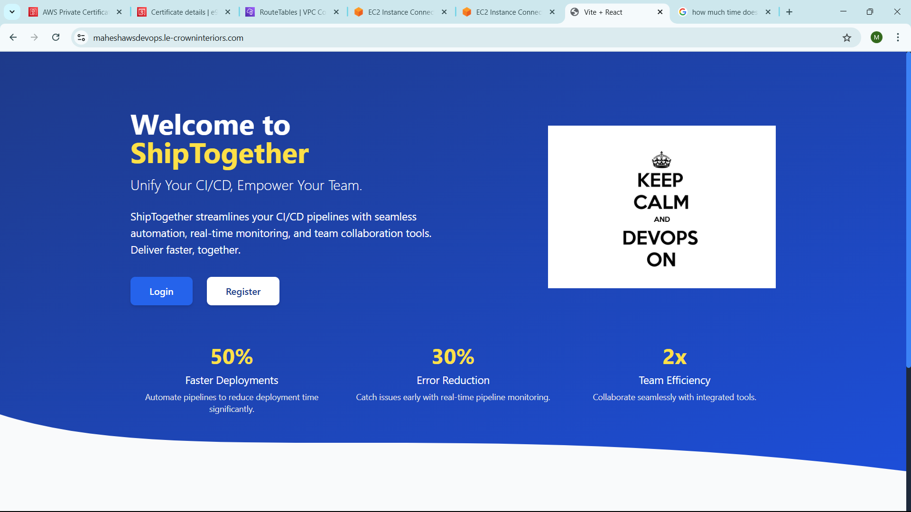

# 🚀 MERN Stack Application on AWS Architecture

## 📚 Introduction
This guide details the deployment of a 3-tier MERN stack application on Amazon Web Services (AWS), featuring a React.js frontend, Express.js backend, and Amazon DocumentDB database. The architecture is designed for high availability, security, and scalability, accessible via the custom subdomain `maheshawsdevops.le-crowninteriors.com`. It leverages AWS services like VPC, EC2, Application Load Balancers (ALBs), Route 53, and AWS Certificate Manager (ACM) to ensure a robust and secure user experience. 🎉

## 🏗️ High-Level Architecture
The application follows a 3-tier architecture:

### Architecture Diagram 🗂️


- User Access 💻: Users access the frontend via `maheshawsdevops.le-crowninteriors.com`
- Route 53 🌐: Manages DNS for the subdomain
- Public ALB (web-alb) 🛡️: Routes public traffic to the web tier
- Web Tier EC2 Instances 🖥️: Host the React.js frontend
- Internal ALB (app-alb) 🔄: Routes API requests to the app tier
- App Tier EC2 Instances ⚙️: Host the Express.js backend
- DocumentDB 📊: Stores application data in private subnets
- VPC 🌳: Isolates resources with public and private subnets


## 🧩 Components
### 1. Domain and DNS 🌐
- **Provider**: Namecheap 🏠
- **Main domain**: le-crowninteriors.com (used for another project)
- **Subdomain**: maheshawsdevops.le-crowninteriors.com (delegated to Route 53)

**Route 53**:
- Hosted Zone: maheshawsdevops.le-crowninteriors.com
- A Record: Points to web-alb-1524460785.us-east-1.elb.amazonaws.com

### 2. Public ALB (web-alb) 📡
- **DNS**: web-alb-1524460785.us-east-1.elb.amazonaws.com
- **Listeners**:
  - HTTP:80 (redirects to HTTPS:443) 🔗
  - HTTPS:443 (uses ACM certificate for maheshawsdevops.le-crowninteriors.com) 🔒

**Security Group**: public-alb-sg
- Inbound: HTTP:80, HTTPS:443 from 0.0.0.0/0
- Outbound: Port 5173 to web-tier-ec2-sg

**Target Group**: web-tg (targets web tier EC2 instances on port 5173) 🎯

### 3. Web Tier 🖥️
- **EC2 Instances**: 10.0.1.43, 10.0.2.74 (in private subnets 10.0.3.0/24, 10.0.4.0/24)
- **Application**: React.js frontend served via serve on port 5173 📦

**Security Group**: web-tier-ec2-sg
- Inbound: Port 5173 from public-alb-sg
- Outbound: Port 80 to internal-alb-sg, all to 0.0.0.0/0

### 4. Internal ALB (app-alb) 📡
- **DNS**: internal-app-alb-670238393.us-east-1.elb.amazonaws.com
- **Listener**: HTTP:80 (forwards to app-tg) 🔗

**Security Group**: internal-alb-sg
- Inbound: Port 80 from web-tier-ec2-sg
- Outbound: Port 5000 to app-tier-ec2-sg

**Target Group**: app-tg (targets app tier EC2 instances on port 5000) 🎯

### 5. App Tier ⚙️
- **EC2 Instances**: i-0277ee990b21fdbb5, i-0639e219746d2fb1f (in private subnets 10.0.3.0/24, 10.0.4.0/24)
- **Application**: Express.js backend on port 5000

**Security Group**: app-tier-ec2-sg
- Inbound: Port 5000 from internal-alb-sg
- Outbound: Port 27017 to docdb-sg, all to 0.0.0.0/0 (via NAT Gateway)

### 6. Database 📊
- **DocumentDB**: Cluster in private subnets 10.0.3.0/24, 10.0.4.0/24

**Security Group**: docdb-sg
- Inbound: Port 27017 from app-tier-ec2-sg

### 7. Network Architecture 🌳
- **VPC**: mern-vpc (CIDR: 10.0.0.0/16)
- **Public Subnets**: 10.0.1.0/24 (us-east-1a), 10.0.2.0/24 (us-east-1b) host Public ALB, Internet Gateway, NAT Gateway 🌍
- **Private Subnets**: 10.0.3.0/24, 10.0.4.0/24 (web/app tiers) & (DocumentDB) 🏠

**Route Tables**:
- Public Subnets: Route 0.0.0.0/0 to Internet Gateway 📶
- Private Subnets: Route 0.0.0.0/0 to NAT Gateway 📡

### 8. Security 🔒
- **ACM Certificate**: Issued for maheshawsdevops.le-crowninteriors.com, attached to Public ALB
- **Security Groups**: Configured for minimal access between components

### 9. Traffic Flow 🔄

| Flow | Description |
|------|-------------|
| User → Frontend | Users access `maheshawsdevops.le-crowninteriors.com`. DNS resolves to Public ALB via Route 53, forwarding to web tier EC2 instances. |
| Frontend → Backend | Frontend makes API calls to `api.maheshawsdevops.le-crowninteriors.com`. Internal ALB forwards to app tier EC2 instances. |
| Backend → Database | Backend connects to DocumentDB over the private network. |

## 📝 Configuration Steps

### 1. Create VPC and Subnets 🌳

**VPC Setup**:
- Create a VPC with CIDR block 10.0.0.0/16, named mern-vpc
- Attach an Internet Gateway (IGW)

**Subnets**:
- Public Subnets:
  - 10.0.1.0/24 in us-east-1a
  - 10.0.2.0/24 in us-east-1b

- Private Subnets (Web/App) & (DocumentDB):
  - 10.0.3.0/24 in us-east-1a
  - 10.0.4.0/24 in us-east-1b

**NAT Gateway**:
- Deploy in one public subnet (e.g., 10.0.1.0/24)

**Route Tables**:
- Public Subnets: Route 0.0.0.0/0 to IGW
- Private Subnets: Route 0.0.0.0/0 to NAT Gateway

**DB Subnet Group**:
- Create mern-docdb-subnet-group including DocumentDB subnets

### 2. Launch EC2 Instances 🖥️

**Web Tier (React.js)**:
- Launch two t2.micro instances in private subnets (10.0.3.0/24, 10.0.4.0/24)
- Install Node.js 22.13.0:
```bash
curl -fsSL https://deb.nodesource.com/setup_22.x | sudo -E bash -
sudo apt-get install -y nodejs
```

## Clone and run the frontend:git clone <your-frontend-repo>
```bash
cd <frontend-directory>
npm install
npm install -g pm2
pm2 start npm --name "react-app" -- start
```


**App Tier (Express.js)**:
- Launch two t2.micro instances in private subnets (10.0.3.0/24, 10.0.4.0/24).
- Install Node.js (same as above).
## Clone and run the backend:
```bash
git clone <your-backend-repo>
cd <backend-directory>
npm install
pm2 start server.js --name "express-app"
```


### 3. Configure Security Groups 🔒


### 3. Configure Security Groups 🔒

| Component       | Security Group      | Inbound Rules                                                     | Outbound Rules                                              |
|----------------|---------------------|-------------------------------------------------------------------|-------------------------------------------------------------|
| Web Tier EC2   | `web-tier-ec2-sg`   | Port 5173 from `public-alb-sg`                                    | Port 80 to `internal-alb-sg`, all to `0.0.0.0/0`            |
| App Tier EC2   | `app-tier-ec2-sg`   | Port 5000 from `internal-alb-sg`                                  | Port 27017 to `docdb-sg`, all to `0.0.0.0/0`                |
| Public ALB     | `public-alb-sg`     | Ports 80, 443 from `0.0.0.0/0`, Port 5173 to `web-tier-ec2-sg`    | —                                                           |
| Internal ALB   | `internal-alb-sg`   | Port 80 from `web-tier-ec2-sg`                                    | Port 5000 to `app-tier-ec2-sg`                              |
| DocumentDB     | `docdb-sg`          | Port 27017 from `app-tier-ec2-sg`                                 | None                                                        |

### 4. Set Up Application Load Balancers (ALBs) 📡

## Create and assign security groups in the AWS EC2 console.

4. Set Up Application Load Balancers (ALBs) 📡

## Public ALB (web-alb):
- Create an internet-facing ALB in mern-vpc.
- Subnets: 10.0.1.0/24, 10.0.2.0/24.
- Security Group: public-alb-sg.
- Target Group: web-tg (port 5173, HTTP, health check path /).
- Listeners:
- HTTP:80 (redirect to HTTPS:443).
- HTTPS:443 (forward to web-tg, attach ACM certificate).


## Internal ALB (app-alb):
- Create an internal ALB in mern-vpc.
- Subnets: 10.0.3.0/24, 10.0.4.0/24.
- Security Group: internal-alb-sg.
- Target Group: app-tg (port 5000, HTTP, health check path /api).
- Listener: HTTP:80 (forward to app-tg).


### 5. Set Up DocumentDB 📊

## Create a DocumentDB cluster:
- Environment: Dev/Test.
- Instance Class: db.t3.medium.
- Cluster Identifier: mern-docdb-cluster.
- VPC: mern-vpc.
- Subnet Group: mern-docdb-subnet-group.
- Security Group: docdb-sg.


## Note the cluster endpoint (e.g., mern-docdb-cluster.cluster-1234567890.us-east-1.docdb.amazonaws.com:27017).
```bash
# Update backend code:const mongoose = require('mongoose');

const connectDB = async () => {
  try {
    const uri = 'mongodb://<username>:<password>@mern-docdb-cluster.cluster-1234567890.us-east-1.docdb.amazonaws.com:27017/?tls=true&replicaSet=rs0&readPreference=secondaryPreferred&retryWrites=false';
    await mongoose.connect(uri, {
      useNewUrlParser: true,
      useUnifiedTopology: true,
      tlsCAFile: '/path/to/rds-combined-ca-bundle.pem'
    });
    console.log('Connected to DocumentDB');
  } catch (error) {
    console.error('DocumentDB connection error:', error);
  }
};

module.exports = connectDB;
```

## Download the RDS CA certificate and place it in your backend directory.

### 6. Update Frontend to Use Internal ALB 🔄

- Update .env in your React.js project:VITE_API_URL=[invalid url, do not cite]


# Redeploy the frontend:npm run build
```bash
pm2 restart react-app
```


### 7. Configure Route 53 🌐

- Create a hosted zone for maheshawsdevops.le-crowninteriors.com.
- In Namecheap, add NS records for the subdomain pointing to Route 53 name servers.
- Create an A record:
- Name: maheshawsdevops.le-crowninteriors.com.
- Alias: web-alb.


### 8. Set Up ACM for HTTPS 🔒

# Request a certificate in ACM (us-east-1):
- Domain: maheshawsdevops.le-crowninteriors.com.
- Validation: DNS.
- Add CNAME record in Route 53 for validation.
- Attach the certificate to web-alb (HTTPS:443 listener).

### 9. Testing and Monitoring 📊

- Verify Access:
- Access `[invalid url, do not cite].
- Ensure frontend loads and API calls succeed.


## CloudWatch:
# Enable monitoring for EC2, ALBs, and DocumentDB.
# Set alarms for CPU usage or unhealthy targets.


### 10. Best Practices 🔧

## Cost:
- Use t2.micro instances (free-tier eligible).
- Choose db.t3.medium for DocumentDB.


### Security:
- Restrict security group rules.
- Use IAM roles for EC2.


### 🛠️ Proof of Concept
